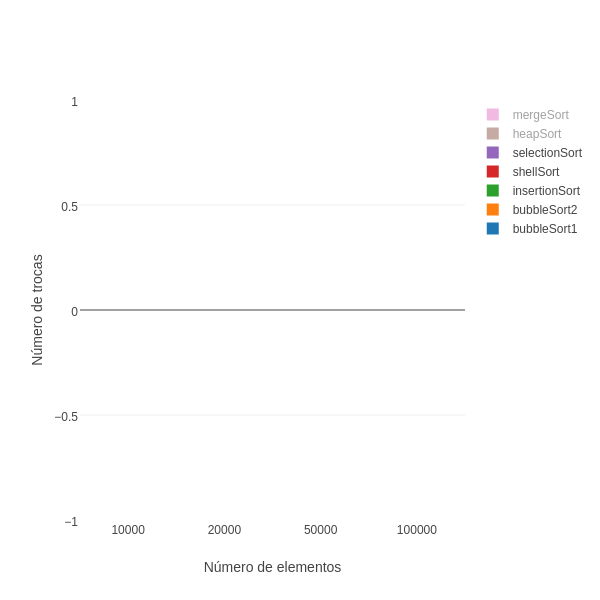

#Trabalho de Projeto e Análise de Algoritmos

##Comparação dos métodos de ordenação utilizando JavaScript
###Guilherme Vincenzi Cavichioli

### 1. Introdução

As tecnologias para internet vêm ganhando espaço no mercado, buscando sempre melhorias para a experiência do usuário.
Tecnologias como o HTML, o CSS e o JS ganharam novas versões e novos espaços dentro do mercado.

O HTML recebeu uma atenção maior por volta de 2008, quando a W3C lançou as especificações de um "novo" HTML no qual estaria trabalhado. Em 2011, o mundo foi apresentado ao chamado HTML5, que trouxe melhorias e facilidades para todos os desenvolvedores.
Foram adicionadas novas tags com novas funções sintáticas, permitindo o trabalho com áudio, vídeo e até mesmo imagens vetoriais.
Outras funcionalidades, como geolocalização e a existência de um canvas para manipulação de desenho gráfico, também chegaram nessa nova versão.

Para o CSS, tecnologia que estiliza as páginas HTML, também em 2011 foi anunciada uma nova versão chamada de CSS3, onde novos seletores foram adicionados, novas regras de estilo foram criadas.
O foco maior dessa nova versão foi abolir o uso de imagens para a criação de fundos com gradiente, bordas arredondadas ou transições e animações. Além disso, é possível criar animações e modificar elementos tanto em 2 quanto em 3 dimensões.

O JS é uma linguagem de programação interpretada (diferente do HTML, que é uma linguagem de marcação, e do CSS, que é uma linguagem de estilo), que foi implementada como parte dos navegadores. Permite que scripts sejam executados do lado do cliente para interagir sem a necessidade deste script passar pelo servidor. É baseada em ECMAScript e atualmente está na versão 5, porém a *ECMA International* já está trabalhando em uma nova versão 6 que trará recursos como o uso de classes, constantes (variáveis imutáveis), *arrow functions*, entre outras novidades.

Em 2012, a Microsoft anunciou o desenvolvimento de um *transcompiler* (converte código escrito em uma linguagem para outra) chamado *TypeScript*, e no início de 2016 finalmente fez o lançamento oficial. Essa nova linguagem permite o uso de orientação a objetos previsto pelo ECMAScript 6, bem como a tipagem dos dados, daí seu nome.


No capítulo 2 serão apresentados os objetivos deste trabalho, no capítulo 3 estarão os algoritmos implementados nesse trabalho, bem como seus respectivos códigos. No capítulo 4 são apresentados os resultados obtidos. 

.... continuar

### 2. Objetivos

Este trabalho tem como objetivo comparar a implementação dos algoritmos de ordenação em uma linguagem interpretada (JavaScript) que roda em um navegador Web.

### 3. Algoritmos

#### 3.1 BubbleSort

Esse algoritmo usa a estratégia de percorrer a coleção a ser ordenada várias vezes, fazendo com que os elementos "mais leves" subam e os "mais pesados" desçam. Ele compara os pares de elementos adjacentes e os troca caso estejam em ordem errada.

A performance do BubbleSort deixa a desejar, uma vez que ele percorre a coleção e para cada elemento, ele percorre novamente, fazendo com que seja impraticável seu uso para coleções muito grandes.

| Caso    | Complexidade |
|---------|:------------:|
| Pior    | O(n²)        |
| Médio   | O(n²)        |
| Melhor  | O(n²)        |

Aqui temos a implementação do algoritmo em *TypeScript*:

```js
bubbleSort1(numbers: number[]) {
  let swaps = 0;
  for (let i = 0; i < numbers.length; i++) {
    for (let j = 0; j < numbers.length-1; j++) {
      if (numbers[j] > numbers[j + 1]) {
        [numbers[j], numbers[j + 1]] = Utils.swap(numbers[j], numbers[j + 1]);
        ++swaps;
      }
    }
  }
  
  return swaps;
}
```
##### 3.1.1 Otimização do BubbleSort

É possível que se faça uma otimização do algoritmo, dando a ele a capacidade de detectar se a coleção já está ordenada. Assim, no melhor caso, ganhamos a complexidade de `O(n)`
 
| Caso    | Complexidade |
|---------|:------------:|
| Pior    | O(n²)        |
| Médio   | O(n²)        |
| Melhor  | O(n)         |

Para isso, basta colocarmos uma variável que vai controlar o primeiro laço, caso a coleção já esteja ordenada, o laço encerra e sabemos que a coleção está ordenada. Veja abaixo essa implementação 

```js
bubbleSort2(numbers: number[]) {    
  let finish = false,
      j = 0, swaps = 0;
  
  while (j < numbers.length && !finish) {
    finish = true;
    
    for (let i = 0; i < numbers.length; i++) {
      if (numbers[i] > numbers[i + 1]) {          
        [numbers[i], numbers[i + 1]] = Utils.swap(numbers[i], numbers[i + 1]);
        finish = false;
        ++swaps;
      }
    }
    
    j++;
  }
  return swaps;
}
```
#### 3.2 Insertion Sort

Esse algoritmo constrói a coleção final um item por vez, ou seja, para cada item da coleção a ser ordenada, todos os itens à esquerda que forem maiores que ele, são movidos para a direita. Quando encontrar um que seja menor ou igual, basta inserir esse item na posição do menor mais um.
Graficamente podemos pensar assim:


É um algoritmo de mais fácil implementação que o Bubble Sort, porém tem a mesma complexidade do Bubble otimizado, o que também o torna impraticável em grandes coleções.

| Caso    | Complexidade |
|---------|:------------:|
| Pior    | O(n²)        |
| Médio   | O(n²)        |
| Melhor  | O(n)         |

Abaixo temos a implementação do Insertion Sort

```js
insertionSort(numbers: number[]) {
  let atual: number;
  let swaps = 0;
  
  for (let i = 1; i < numbers.length; i++) {
    atual = numbers[i];
    
    for (var j = i - 1; j >= 0 && atual < numbers[j]; j--) {
      numbers[j + 1] = numbers[j]; 
      ++swaps;
    }
    
    numbers[j + 1] = atual;
  }
  
  return swaps;
}
```
#### 3.3 Selection Sort

Como o nome já diz, esse algoritmo seleciona o menor elemento e coloca ele na posição correta. Sendo assim, a coleção inicial é dividida em duas partes: à direita, uma subcoleção de itens já ordenados e à esquerda, o restante dos itens ainda a serem ordenados.
A complexidade desse algoritmo para todos os casos é o mesmo, pois a partir de um item, todos os outros a seguir serão acessados.

| Caso    | Complexidade |
|---------|:------------:|
| Pior    | O(n²)        |
| Médio   | O(n²)        |
| Melhor  | O(n²)        |

Abaixo temos sua respectiva implementação

```js
selectionSort(numbers: number[]) {
  let swaps = 0;    
  for (let i = 0; i < numbers.length - 1; i++) {
    let k = i;
    let menor = numbers[i];
    
    for (let j = i + 1; j < numbers.length; j++) {
      if (numbers[j] < menor) {
        k = j;
        menor = numbers[j];
      }
    }
    
    numbers[k] = numbers[i];
    numbers[i] = menor;
    if (k != i) 
      ++swaps;
  }
  
  return swaps;
}
```

#### 3.4 Shell Sort

Utilizando a ideia de troca entre itens distantes de uma coleção, esse algoritmo define um "salto" a partir de qual os itens serão comparados.
Isso facilita o trabalho para quando os saltos forem menores, pois os itens maiores, bem como os menores, já estarão próximos a suas posições finais.

Sua complexidade depende de como os saltos são calculados, então, sem perda de generalidade, podemos dizer que

| Caso    | Complexidade |
|---------|:------------:|
| Pior    | O(nlog²(n))  |
| Médio   | O(nlog²(n))  |
| Melhor  | O(n)         |

Abaixo temos a implementação do algoritmo

```js
shellSort(numbers: number[]) {
    let swaps = 0;    
    for (let salto = Math.floor(numbers.length/2);
         salto > 0;
         salto = Math.floor(salto / 2)) {
      for (let i = salto; i < numbers.length; i++) {
        let x = numbers[i];
        for (var j = i; (j >= salto) && (x < numbers[j - salto]); j -= salto) {
          numbers[j] = numbers[j - salto];
          ++swaps;
        }
        numbers[j] = x;
      }
    }
    
    return swaps;
  }
```

#### 3.5 Heap Sort

Esse algoritmo prepara uma lista como um primeiro tratamento, chamada de "heap", que é uma árvore binária que tem algumas propriedades especiais:
* Deve ser completa exceto pelo último nível
* Cada elemento deve ser maior que seus filhos

Com a árvore montada, o maior elemento sempre estará na raiz (primeiro elemento do vetor) e pode ser posicionado no final da coleção.
Toda vez que uma troca for feita, a árvore é reconstruída e o tamanho do vetor "diminui", já que o maior elemento já está posicionado.

Abaixo temos sua complexidade e sua implementação

| Caso    | Complexidade |
|---------|:------------:|
| Pior    | O(nlog(n))   |
| Médio   | O(nlog(n))   |
| Melhor  | O(nlog(n))   |

```js
public static siftDown(numbers: number[], root: number,
                       bottom: number, swaps: number):number {
  let maxChild = root * 2 + 1;
  
  if (maxChild < bottom) {
    let otherChild = maxChild + 1;
    maxChild = (numbers[otherChild] > numbers[maxChild]) ? otherChild : maxChild;
  }
  else if (maxChild > bottom) return swaps;
  
  if (numbers[root] >= numbers[maxChild]) return swaps;
  
  [numbers[root], numbers[maxChild]] = this.swap(numbers[root], numbers[maxChild]);
  ++swaps;
  
  this.siftDown(numbers, maxChild, bottom, swaps);
  
  return swaps;
}

heapSort(numbers: number[]) {
  let swaps:number = 0;
  
  for (let i = Math.floor(numbers.length / 2); i >= 0; i--) {
    swaps = Utils.siftDown(numbers, i, numbers.length-1, swaps);
  }
  
  for (let i = numbers.length - 1; i >= 1; i--) {
    [numbers[0], numbers[i]] = Utils.swap(numbers[0], numbers[i]);
    ++swaps;
    swaps = Utils.siftDown(numbers, 0, i - 1, swaps);
  }
  
  return swaps;
}
```

#### 3.6 Merge Sort
É um algortimo baseado em *divide and conquer* (divisão e conquista), consiste em dividir o problema em sub-problemas e resolvê-los para depois agrupar os resultados.

Abaixo temos sua complexidade e sua implementação

| Caso    | Complexidade |
|---------|:------------:|
| Pior    | O(nlog(n))   |
| Médio   | O(nlog(n))   |
| Melhor  | O(nlog(n))   |

```js
public static merge(numbers: number[], begin: number, mid: number, end: number) {    
  let temp: number[] = [],
      i = begin, j = mid, k = 0;
  
  while (i < mid && j < end) {
    if (numbers[i] <= numbers[j]) temp[k++] = numbers[i++];
    else temp[k++] = numbers[j++];
  }
  
  while (i < mid) {
    temp[k++] = numbers[i++];
    ++_swaps;
  };
  while (j < end) {
    temp[k++] = numbers[j++];
    ++_swaps;
  };
  
  for (i = begin; i < end; i++) {
    numbers[i] = temp[i-begin];
  }
  
  return numbers;
}

mergeSort(numbers: number[]) {
  _swaps = 0;
  Sort._mergeSort(numbers, 0, numbers.length);
  return _swaps;
}
static _mergeSort(numbers: number[], begin:number, end: number) {
  if (begin < end -1) {
    let mid = Math.floor((begin + end) / 2);
    
    this._mergeSort(numbers, begin, mid);
    this._mergeSort(numbers, mid, end);
    numbers = Utils.merge(numbers, begin, mid, end);
  }
}
``` 

#### 3.7 Quick Sort

É um algoritmo *divide and conquer* assim como o Merge Sort. Primeiro, é escolhido um pivô, podendo ser qualquer item da coleção (geralmente se usa o item central ou o primeiro item). 
Em seguida todos os itens menores são colocados à esquerda do pivô e os maiores à direita. Assim, o pivô já está na sua posição final. Agora basta aplicar recursivamente o Quick Sort para os itens menores e maiores.

Abaixo temos sua complexidade e sua implementação

| Caso    | Complexidade |
|---------|:------------:|
| Pior    | O(n²)        |
| Médio   | O(nlog(n))   |
| Melhor  | O(nlog(n))   |

```js
public static partition(numbers: number[], left: number, right: number, swaps: number) {
  // let pivot: number = Math.floor(left+right / 2),
  let pivot: number = left,
      i = left, j = right;       
      
  while (i <= j) {
    while (numbers[i] < numbers[pivot]) i++;
    while (numbers[j] > numbers[pivot]) j--;
    
    if (i <= j) {
      [numbers[i], numbers[j]] = this.swap(numbers[i], numbers[j]);
      ++swaps;
      
      i++;
      j--;
    }
  }
  
  return [i, swaps];
}

static _quickSort(numbers: number[], left: number, right: number, swaps: number) {
  let index: number;
  
  if (numbers.length > 1) {
    [index, swaps] = Utils.partition(numbers, left, right, swaps);
    
    if (left < index - 1) swaps = this._quickSort(numbers, left, index - 1, swaps);
    if (index < right) swaps = this._quickSort(numbers, index, right, swaps);
  }
 
  return swaps;
}
quickSort(numbers: number[]) {
  let swaps = 0;
  swaps = Sort._quickSort(numbers, 0, numbers.length-1, swaps);
  return swaps;
}
```

### 4. Resultados Individuais

Nesse capítulo apresentaremos os resultados obtidos para a execução dos algoritmos de ordenação apresentados.

#### 4.1 Interface com o usuário

A implementação foi feita em *TypeScript*, porém o resultado final do código é em JavaScript.
A interface foi construída com Jade, linguagem de template para HTML, e Sass, um pré-compilador de CSS.
Segue abaixo uma imagem do resultado final.


1. No "Passo 1" escolhemos os algoritmos que serão executados.
1. No "Passo 2" são escolhidas quantas vezes o algoritmo será executado.
1. No "Passo 3" estão as quantidades de elementos que serão ordenados.
1. No "Passo 4" definimos se as entradas serão aleatórias, crescentes ou decrescentes.

Vale ressaltar que as opções "1 vezes" e "20 elementos" foram adicionadas para que testes rápidos possam ser feitos.
Apesar de existirem valores maiores, foram executados testes apenas até cem mil elementos, baseado no tempo do método mais demorado.

#### 4.2 Executando o BubbleSort

As execuções do BubbleSort mostraram que, independente das entradas serem crescentes ou decrescentes (melhor e pior caso), seu tempo de execução será alto.
Para entradas crescentes, sua execução é muito mais rápida que para entradas aleatórias, já que o tempo de realizar uma troca não existe, como podemos ver no gráfico da Figura 3.

{width=300px}

Fica fácil de notar isso quando olhamos para o gráfico do número de trocas (Figura 4).
Para entradas crescentes, não existem trocas, enquanto que para entradas decrescentes são feitas, aproximadamente 5 bilhões de trocas (100 mil elementos).
Mesmo não existindo trocas para entradas crescentes, seu tempo ainda é computado como `n²`, já que a condição para a troca é executada `n` vezes. 

{width=300px}

#### 4.3 Executando o BubbleSort Melhorado

A diferença para esse algoritmo fica só pelo gráfico de tempo, em que a execução dos elementos crescentes se torna `n`.
Um detalhe que vale ressaltar é que, o número de trocas é o mesmo, mas o tempo de execução deste algoritmo é um pouco maior. Isso acontece pois existe a verificação de uma variável a mais e isso tem um custo. (Figura 5)

{width=300px}

Apesar de parecer uma reta, o resultado para as entradas crescentes é representado na Figura 6.
Note que o tempo para 10 mil é maior que o para 20 mil: Isso ocorre dadas as condições computacionais das execuções.

{width=300px}

#### 4.4 Executando o InsertionSort

Os resultados obtidos com esse algoritmo são muito semelhantes ao BubbleSort Melhorado, o que já era previsto dado que suas complexidades são iguais.
Repare que os gráficos são iguais, porém os tempos possuem uma diferença considerável: o Bubble com entradas decrescentes demora 200 mil milisegundos, enquanto o Insertion para a mesma entrada, demora 16 mil milisegundos.

{width=300px}

O número de trocas é o mesmo do BubbleSort melhorado, veja na Figura 8:

{width=300px}

#### 4.5 Executando o ShellSort

Os testes feitos sobre o ShellSort resultaram em gráficos interessantes.
Repare que para entradas pequenas, o melhor caso tende a diminuir com o tempo, porém depois ele cresce normalmente (a partir de 20 mil).
Já as outras entradas tem um comportamento esperado. (Figura 9)

{width=300px}

O número de trocas é bem menor quando comparado com os BubbleSorts. No entanto, para entradas decrescentes, são feitas menos trocas que para entradas aleatórias. (Figura 10)

{width=300px}

#### 4.6 Executando o SelectionSort

Para esse algoritmo, os gráficos são muito próximos para pequenas quantidades (todos os casos), porém, quando o número de elementos cresce, passa a ser mais evidente que o melhor caso é mais rápido e o pior caso é mais lento.
Nota-se também o comportamento `n²` apresentado anteriormente na seção 3.3. (Figura 11)

{width=300px}

A quantidade de trocas está representado na Figura 12

{width=300px}

#### 4.7 Executando o HeapSort

Esse algoritmo apresenta um comportamento muito semelhante para todos os casos. Note que para entradas pequenas, os tempos são muito parecidos, enquanto que para entradas grandes (100 mil elementos), os tempos começam a ficar maiores para entradas aleatórias.
Note também que o tempo de execução é baixo, na casa dos 140 milisegundos. (Figura 13)

{width=300px}

O número de trocas também é alto mas isso não influenciou no tempo de execução. (Figura 14)

{width=300px}

#### 4.8 Executando o MergeSort

Para todos os casos, os tempos do MergeSort se aproximaram muito, e é evidente pela Figura 15 que entradas aleatórias tomam mais tempo.
Porém, esse algoritmo não é tão estável: outros testes feitos, apresentaram diferentes resultados, com a maioria muito semelhante ao apresentado na Figura 15. 

{width=300px}

A quantidade de trocas está representado na Figura 16

{width=300px}

#### 4.9 Executando o QuickSort

Esse algoritmo trouxe alguns resultados que não agradaram: para entradas crescentes e decrescentes (melhor e pior caso) acontece um estouro de pilha.
Então, apenas resultados para entradas aleatórias serão apresentados.
O QuickSort se mostrou muito eficiente realizando a ordenação de 100 mil elementos em apenas 32 milisegundos (Figura 17), mesmo fazendo 492 mil trocas aproximadamente (Figura 18).

{width=300px}

{width=300px}

### 5. Resultados agregados

Após um estudo de todos os métodos separados, serão apresentados os resultados de comparação entre métodos.

#### 5.1 Entradas aleatórias

Na Figura 19, podemos notar que o BubbleSort Melhorado, apesar de ser otimizado", para entradas aleatórias ele se torna menos eficiente que seu concorrente direto, o BubbleSort Normal.
Isso porque esse algoritmo tem uma comparação a mais, conforme explicado acima.
Também é possível ver que o SelectionSort é o terceiro mais lento, seguido do InsertionSort.

{width=300px}

Comparando trocas (Figura 20), temos que os algoritmos que apresentam as maiores quantidades são o InsertionSort e os BubbleSorts.

{width=300px}

---

Os 3 algoritmos mais rápidos são o HeapSort, o MergeSort e o ShellSort como o mais rápido para entradas aleatórias (Figura 21).

{width=300px}

Porém, analisando o gráfico do número de trocas (Figura 22), é notável a quantidade feita pelo ShellSort, tornando-o menos favorável dos 3 pelo custo computacional. 

{width=300px}

---

#### 5.2 Entradas crescentes

Para entradas crescentes, a diferença é que o BubbleSort Melhorado não está entre os mais lentos. (Figura 23)
Além disso, o número de trocas é zero para quase todos, exceto para o MergeSort e o HeapSort. (Figura 24)

{width=300px}

{width=300px}

---

Os 3 algoritmos mais rápidos agora são o ShellSort, o BubbleSort Melhorado e o InsertionSort (Figura 25).
Eles são executados na faixa de 6 milisegundos, aproximadamente, e não realizam nenhuma troca (Figura 26). 

{width=300px}

{width=300px}

#### 5.3 Entradas decrescentes

Para entradas decrescentes, temos o mesmo comportamento dos algoritmos mais lentos para entradas aleatórias, porém o InsertionSort e o SelectionSort se alternam (Figura 27).
Mesmo se alternando, o comportamento destes algoritmos é muito semelhante e isso ocorre para quase todos os testes.   

Já o número de trocas é na casa dos bilhões para os 3 mais lentos (Figura 28), exceto que o SelectionSort faz menos trocas que o InsertionSort (tendo o mesmo comportamento em tempo).

{width=300px}

{width=300px}

---

Os 3 algoritmos mais rápidos são de novo o HeapSort, o MergeSort e o ShellSort, sendo este o mais rápido dos 3 (Figura 29).

Porém, comparado com entradas aleatórias, o que diferencia são os números de trocas (Figura 30): o MergeSort aqui faz mais trocas que o ShellSort.

{width=300px}

{width=300px}

### 6. Conclusões

Avaliando os resultados obtidos (e descritos nesse texto), para a relação "número de trocas/tempo de execução", podemos classificar como

|  Método   | Entradas Crescentes | Entradas Aleatórias | Entradas Decrescentes |
|-----------|:-------------------:|:-------------------:|:---------------------:|
| HeapSort  |         *2º*        |        *2º*         |        **1º**         |
| MergeSort |          3º         |       **1º**        |          3º           |
| ShellSort |        **1º**       |         3º          |         *2º*          |

Portanto, com essa avaliação é possível afirmar que a melhor escolha para casos genéricos é o **HeapSort**.
